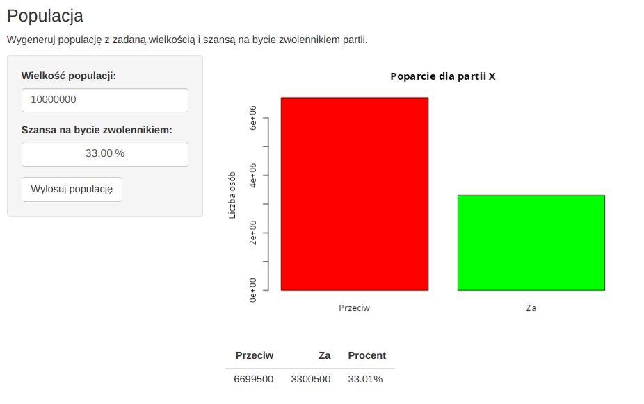
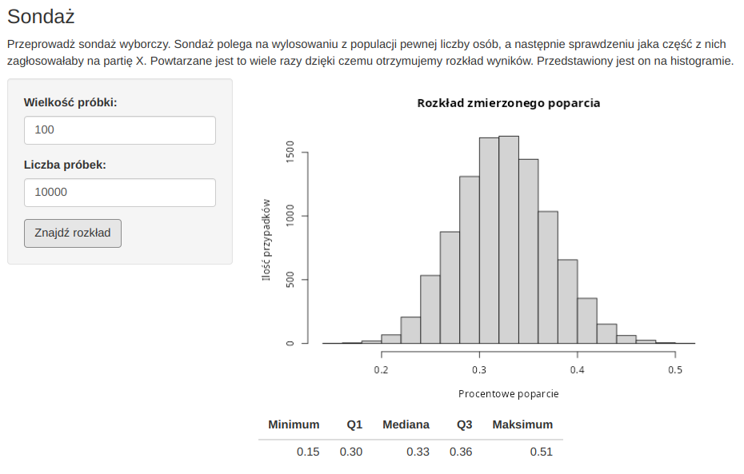
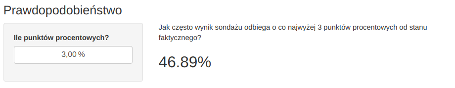

# Sondaż wyborczy partii X

## Projekt w R

Symulacja przeprowadzania sondaży na wylosowanej populacji, w której określony procent ludzi
popiera partię X. Sondaże powtarzane są wielokrotnie, dzięki czemu można poznać odpowiedź na
pytanie: „Jak często wynik sondażu odbiega o co najwyżej n punktów procentowych od stanu
faktycznego?”.

